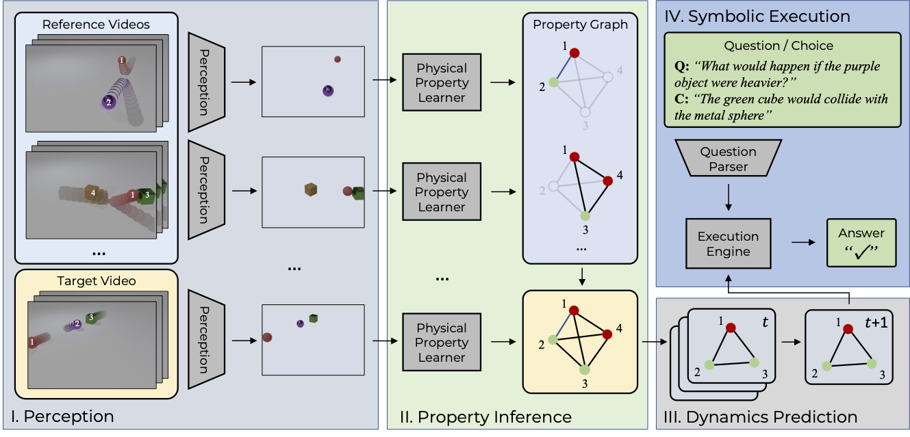

# ComPhy
This repository holds the code for the paper.

> 
**ComPhy: Compositional Physical Reasoning ofObjects and Events from Videos**, (ICLR 2022)
>


[Project Website](https://comphyreasoning.github.io/)

## Framework
<div align="center">
  
</div>

## Code Preparation
```
git clone https://github.com/comphyreasoning/compositional_physics_learner.git 
```

## Installation
```
pip install -r requirements
```

## Data Preparation
- Download videos, video annotation, questions from the [project website](https://comphyreasoning.github.io/).

## Fast Evaluation
- Download the regional proposals with attribute and physical property prediction from the anonymous [Google drive](https://drive.google.com/file/d/1LsOU-OfODxx8gPj3XdPvvThITGRY3Poy/view?usp=sharing)
- Download the dynamic predictions from the anonymous [Google drive](https://drive.google.com/file/d/10JyHNW0dJrmnLbIbr8TOgHTRuKdQWflD/view?usp=sharing)
- Run executor for factual questions.
```
sh scripts/test_oe_release.sh
```
- Run executor for multiple-choice questions.
```
sh scripts/test_mc_release.sh
```
## Supporting sub-modules
### Physical Property Learner and Dynamic predictor
Please refer to [this repo](https://github.com/zfchenUnique/property_learner_predictor) for property learning and dynamics prediction.
### Perception
This module uses the public [NS-VQA](https://github.com/kexinyi/ns-vqa.git)'s perception module object detection and visual attribute extraction.
### Program parser 
This module uses the public [NS-VQA](https://github.com/kexinyi/ns-vqa.git)'s program parser module to tranform language into executable programs.
